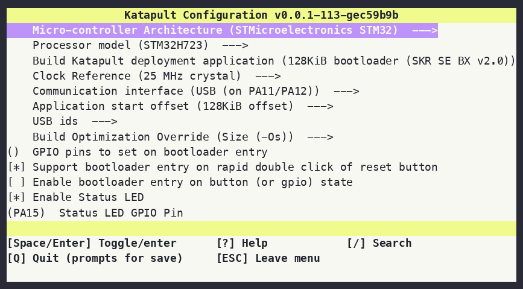

This page covers a from-scratch install of FOCI on an Ouroboros
(STM32H723ZG) board wired to a Klipper host running on a Raspberry Pi. Three
steps:

1. Flash the [Katapult](https://github.com/Arksine/katapult) bootloader onto
   the board (one-time, over USB DFU).
2. Download and flash the FOCI firmware through Katapult.
3. Install the `klipper-foci` host module.

## Prerequisites

- The Ouroboros board's USB port connected to the Pi.
- SSH access to the Pi.
- `dfu-util`, `git`, and a `gcc-arm-none-eabi` toolchain on the Pi (Klipper's
  own setup already installs the ARM toolchain; if you built Klipper's MCU
  firmware on this Pi before, you have it):

  ```sh
  # Install the DFU flashing tool and build dependencies
  sudo apt update
  sudo apt install -y dfu-util git build-essential
  ```

## 1. Installing Katapult on the Ouroboros

Katapult is the USB bootloader FOCI's flashing tooling talks to. It's flashed
once, directly to the STM32H723 over its ROM DFU bootloader; after that,
updating FOCI itself never needs DFU again.

### Build Katapult

On the Pi:

```sh
# Fetch Katapult and open its build configuration menu
git clone https://github.com/Arksine/katapult ~/katapult
cd ~/katapult
make menuconfig
```

Configure the menu with the settings below. This is the exact configuration
validated against Ouroboros hardware:



`USB ids` and `Build Optimization Override` are left at their stock defaults;
nothing to change there.

| Setting | Value |
|---|---|
| Micro-controller Architecture | STMicroelectronics STM32 |
| Processor model | STM32H723 |
| Build Katapult deployment application | 128KiB bootloader |
| Clock Reference | 25 MHz crystal |
| Communication interface | USB (on PA11/PA12) |
| Application start offset | 128KiB offset |
| GPIO pins to set on bootloader entry | (blank) |
| Support bootloader entry on rapid double click of reset | enabled |
| Enable bootloader entry on button (or gpio) state | disabled |
| Enable Status LED | enabled |
| Status LED GPIO Pin | `PA15` |

Save and exit, then build:

```sh
# Rebuild against the saved config
make clean
make -j4
```

### Put the board in DFU mode and flash

1. On the Ouroboros board, hold the **BOOT** button, tap **RESET**, then
   release **BOOT**. This drops the STM32H723 into its ROM DFU bootloader.
2. Confirm it enumerated as a DFU device:

   ```sh
   lsusb | grep -i "0483:df11"
   ```

   You should see a line like `Bus 001 Device 004: ID 0483:df11
   STMicroelectronics STM Device in DFU Mode`. If nothing shows up, repeat
   the BOOT+RESET sequence. It's timing-sensitive.
3. Flash Katapult:

   ```sh
   sudo dfu-util -a 0 -s 0x08000000:leave -D ~/katapult/out/katapult.bin -d 0483:df11
   ```
4. After it leaves DFU, confirm Katapult is running:

   ```sh
   ls /dev/serial/by-id/ | grep katapult
   ```

   You should see something like
   `usb-katapult_stm32h723xx_<serial>-if00`. If nothing shows up, double-tap
   **RESET**. Katapult's double-reset entry (enabled above) also drops it
   back into the bootloader if the `leave` reset didn't fully take. This is
   a one-time step. Katapult stays resident even as you reflash FOCI
   itself.

## 2. Downloading and flashing the firmware

FOCI release builds are published as GitHub Release assets on
[`foci-rs/foci`](https://github.com/foci-rs/foci/releases), named
`ouroboros-fw-v<version>-<flavor>.bin` (`<flavor>` is `prod` for normal use,
`trace` only when you specifically need the USB trace-capture stream for
diagnostics).

With Katapult already resident on the board (step 1), flashing FOCI itself
never needs DFU or the BOOT/RESET buttons again. Katapult's own
`flashtool.py` handles it over the serial connection.

### Download

On the Pi:

1. Look up the latest release's version tag:

   ```sh
   FOCI_VERSION=$(curl -s https://api.github.com/repos/foci-rs/foci/releases/latest \
     | grep -Po '"tag_name": *"v\K[^"]+')
   ```

2. Download the firmware binary and its checksum into your home directory
   (the flash step below reads it from there), then verify it:

   ```sh
   cd ~
   curl -LO "https://github.com/foci-rs/foci/releases/download/v${FOCI_VERSION}/ouroboros-fw-v${FOCI_VERSION}-prod.bin"
   curl -LO "https://github.com/foci-rs/foci/releases/download/v${FOCI_VERSION}/ouroboros-fw-v${FOCI_VERSION}-prod.bin.sha256"

   sha256sum -c "ouroboros-fw-v${FOCI_VERSION}-prod.bin.sha256"
   ```

### Flash

1. Find the Katapult device:

   ```sh
   ls /dev/serial/by-id/ | grep katapult
   ```

2. Flash the downloaded `.bin`:

   ```sh
   python3 ~/katapult/scripts/flashtool.py \
     -d /dev/serial/by-id/usb-katapult_stm32h723xx_<serial>-if00 \
     -f ~/ouroboros-fw-v${FOCI_VERSION}-prod.bin \
     -v
   ```

   `flashtool.py` connects to the bootloader, writes the application, and
   verifies it against a SHA1 of the written flash. A `Flash Success` (or
   `Programming Complete`, depending on the Katapult version) line at the end
   means the board is now running FOCI and will enumerate as a Klipper MCU.

3. Confirm the board enumerates as FOCI/Klipper, not Katapult:

   ```sh
   ls /dev/serial/by-id/ | grep -i foci
   ```

   Note down this `/dev/serial/by-id/...` path. You'll need it for the
   `[foci <stepper>]` section in your printer config.

To reflash later, for a firmware update, repeat the Download and Flash
steps. Katapult is already there waiting.

## 3. Installing the FOCI Klipper module

FOCI needs a small Python module (`klipper-foci`) installed into Klipper's
`klippy-env` so Klipper knows how to talk to the FOCI MCU. Run this on the
printer's Pi:

```sh
curl -sL https://raw.githubusercontent.com/foci-rs/foci/main/install.sh | bash
```

This detects Kalico vs. mainline Klipper, installs the package from the
project's self-hosted index, places the loader shim in the right
`klippy/extras` (or `klippy/plugins`) directory, and registers it with
Moonraker's `update_manager` so it keeps itself updated going forward.

Restart the Klipper service after installing. `FIRMWARE_RESTART` only resets
the MCU; it does not reload Klipper's Python modules. A newly installed
module needs the full service restart:

```sh
sudo systemctl restart klipper
```

Continue with [Configuration](/getting-started/configuration/) to add the
board to `printer.cfg`.
